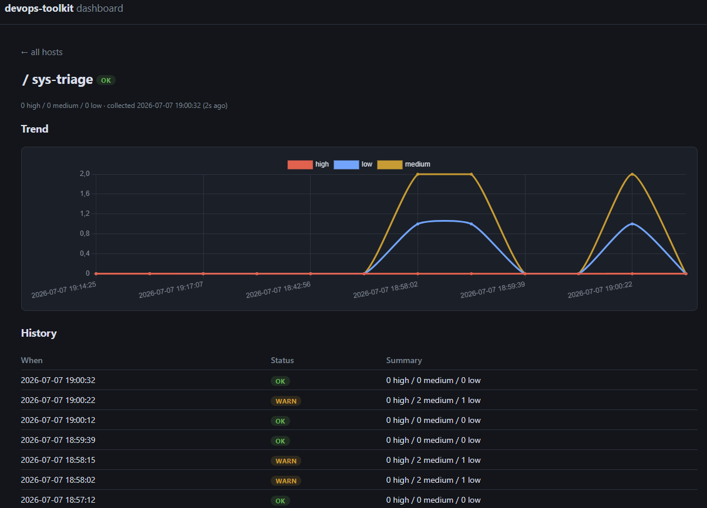

# dashboard

A read-only web dashboard over the toolkit: scheduled collectors run the
tools with JSON output, the dashboard renders red/green tiles per host and
tool with drill-down into findings, history, and trends — and notifies you
when a tile turns red or a collector goes silent. Open it in the morning,
see everything green (or not), get on with your day.



> **The dependency exception.** Every *tool* in this repo is standard
> library only. The dashboard is a separate deployable and uses FastAPI +
> Jinja2 (see `requirements.txt`) — it never has to run on the boxes being
> monitored, only wherever you host the UI.

## How it works

```
each monitored host                                     anywhere
─────────────────────────                               ─────────────────────────
cron / systemd timer                                    docker container
  └─ collect.sh runs a tool ──┬─► local/shared file ──► imported ─┐
                              └─► POST /api/v1/ingest (token) ────┼─► SQLite ─► web UI
                                                                  ─┘  history    trends
```

- **Collectors** are just the tools you already run, wrapped in
  [collect.sh](./collect.sh). Two delivery modes:
  - **file mode** — writes `<data-dir>/<hostname>/<tool>/<ts>.json`
    (same box, NFS, or rsync); the dashboard imports new files
    automatically
  - **post mode** (`--post URL --token T`) — remote hosts POST results
    straight to the ingest API with a per-host bearer token; no shared
    filesystem needed
- **History lives in SQLite** (a named Docker volume), which powers the
  per-tool trend charts: finding counts over time, endpoint latency,
  backup size.
- **The dashboard never executes anything.** It derives a status per tile
  (`ok` / `warn` / `crit` / `unknown`), marks tiles **stale** when results
  stop arriving (so a dead cron looks broken, not green), and
  auto-refreshes via htmx every 60 s.
- Tools understood out of the box: `sys-triage`, `host-hardening-check`,
  `k8s-resource-auditor`, `endpoint-watchdog`, `db-backup-rotate`,
  `docker-cleanup`. Anything else that follows the
  `summary: {high/medium/low}` convention works automatically; unrecognized
  payloads render as raw JSON instead of failing.

## Quick start

```bash
cd dashboard

# 1. Start the dashboard (serves on localhost:8080, reads /var/lib/devops-dashboard)
docker compose up -d
#    ...or read results from somewhere else, e.g. for a local test:
# DASHBOARD_DATA=$HOME/dashdata docker compose up -d

# 2. On each monitored host, schedule collectors — e.g. in crontab:
*/5 * * * *  /opt/devops-toolkit/dashboard/collect.sh /var/lib/devops-dashboard endpoint-watchdog -- python3 /opt/devops-toolkit/endpoint-watchdog/watchdog.py --config /etc/endpoint-watchdog/config.json --output json
0 * * * *    /opt/devops-toolkit/dashboard/collect.sh /var/lib/devops-dashboard sys-triage -- python3 /opt/devops-toolkit/sys-triage/triage.py --output json
0 6 * * *    /opt/devops-toolkit/dashboard/collect.sh /var/lib/devops-dashboard host-hardening-check -- sudo python3 /opt/devops-toolkit/host-hardening-check/hardening-check.py --output json
30 2 * * *   /opt/devops-toolkit/dashboard/collect.sh /var/lib/devops-dashboard db-backup-rotate -- python3 /opt/devops-toolkit/db-backup-rotate/db-backup.py --engine postgres --database shop --backup-dir /var/backups/db --verify restore --json
```

Then open <http://localhost:8080>.

Without Docker it's a plain ASGI app:

```bash
pip install -r requirements.txt
DASHBOARD_DATA_DIR=/var/lib/devops-dashboard uvicorn app:app --port 8080
```

### One host vs. many

- **Single host**: run the container on the same box, use file-mode
  collectors; done.
- **Multiple hosts**: give each host a token and use post mode — no shared
  filesystem required:

```bash
# on the dashboard box: one token per host ("*" would be a shared token)
DASHBOARD_TOKENS="web1:$(openssl rand -hex 24),db1:$(openssl rand -hex 24)" docker compose up -d

# on each monitored host (crontab), post instead of writing files:
0 * * * * /opt/devops-toolkit/dashboard/collect.sh --post https://dash.internal:8080 --token "$(cat /etc/dashboard.token)" sys-triage -- python3 /opt/devops-toolkit/sys-triage/triage.py --output json
```

A host's token only lets it write results **for its own hostname** — a
compromised web server can't overwrite your database host's green tiles.
File mode still works too (NFS/rsync into the data directory merges
per-host subdirectories cleanly and gets imported on the next page load).

## Configuration

| Setting | How | Default |
|---|---|---|
| Data directory (in the container) | `DASHBOARD_DATA_DIR` env var | `/data` |
| Data directory (host side, compose) | `DASHBOARD_DATA` env var when running `docker compose up` | `/var/lib/devops-dashboard` |
| SQLite database path | `DASHBOARD_DB` env var | `/db/dashboard.sqlite3` (named volume in compose) |
| Ingest tokens | `DASHBOARD_TOKENS` env var (`host:token,...`, `*` = any host) or `DASHBOARD_TOKENS_FILE` (one per line) | unset — ingest disabled |
| State-change notifications | `DASHBOARD_NOTIFY_SLACK` / `DASHBOARD_NOTIFY_WEBHOOK` env vars | unset — notifications disabled |
| History kept per host/tool (database) | `keep` in `db.py` | 1000 |
| Results kept per tool (file mode) | `collect.sh --keep N` | 200 |
| Staleness budget | per tool in `store.py` (`STALE_AFTER`) | 15 min for endpoint-watchdog, 26 h otherwise |

## Endpoints

| Path | What |
|---|---|
| `/` | The tile grid, auto-refreshing |
| `/host/{host}/{tool}` | Latest result, trend chart, status history, raw JSON |
| `POST /api/v1/ingest/{host}/{tool}` | Store a result (bearer token; body = the tool's JSON output) |
| `/api/v1/summary` | The whole grid as JSON (for scripting/alerting) |
| `/api/v1/series/{host}/{tool}` | Chart points as JSON (what the trend chart renders) |
| `/healthz` | Container health check |

## Notifications

The dashboard is the only component that can notice a **silent** collector:
a dead cron on a monitored host produces no failing run and no alert from
the tools themselves — just a tile quietly going stale. A background sweep
(every 60 s) watches every tile and sends one message per state change
involving `crit` or `stale`, including the recovery:

```
[CRIT] web1/sys-triage: 2 high / 1 medium / 0 low (was ok)
[STALE] db1/db-backup-rotate: no results arriving — is the collector still running? (was ok)
[RECOVERED] web1/sys-triage: 0 high / 0 medium / 1 low (was crit)
```

Enable it by setting one or both destinations (unset = silent dashboard):

| Env var | Destination |
|---|---|
| `DASHBOARD_NOTIFY_SLACK` | Slack-compatible incoming webhook (Slack, Mattermost, Discord's `/slack` endpoint) — gets the text above |
| `DASHBOARD_NOTIFY_WEBHOOK` | Any URL — gets the transition as JSON (`host`, `tool`, `previous`, `current`, `headline`, `text`) |

`warn`-level wobbles are tracked but never notified — pages are for things
that need a human. `ok -> warn -> crit` notifies once, at the `crit` step,
with `previous: warn`.

## Security posture

- The dashboard is **read-only by design** — there is deliberately no "run
  tool" button. A web process that executes host commands (some of which
  want root) is an attack surface this project doesn't need; the tools'
  natural cadence suits scheduled runs.
- The container runs as a non-root user with the data volume mounted `:ro`.
- The compose file binds to `127.0.0.1` — expose it through a reverse proxy
  with auth, or keep it on a VPN/Tailscale network. Results contain
  hostnames, ports, and finding details you don't want public.

## Testing

- `tests/test_dashboard_store.py` and `tests/test_dashboard_db.py` — the
  parsing/status logic and the SQLite store; stdlib-only, run with the
  repo's normal suite.
- `tests/test_dashboard_app.py` — FastAPI routes (pages, ingest auth,
  series API) via TestClient; skips itself unless the web dependencies are
  installed, so the toolkit's dependency-free workflow is unaffected. CI
  runs it with deps installed, builds the Docker image, and smoke-tests
  the running container including a real token-authenticated ingest.

## Roadmap

- **Phase 3 (maybe)**: gated "run now" via an allowlisted job queue — only
  if scheduled runs ever feel insufficient.

## License

MIT — see the top-level [LICENSE](../LICENSE) in this repo.
